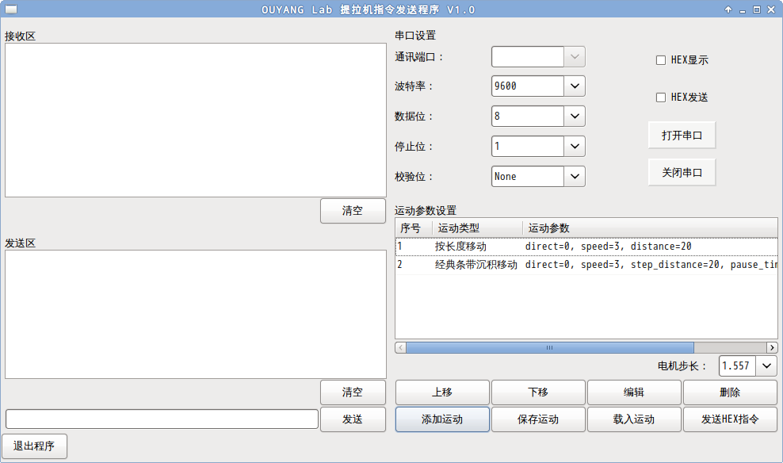
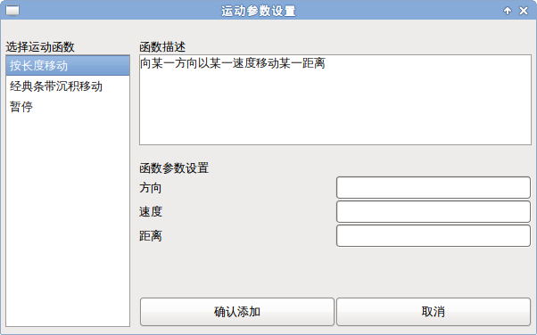

# Description
A graphical user interface (GUI) serial communication program with combination of command function. [一个带有组合命令功能的的图形界面串口通讯程序。]

# Paremeter note

    Table: code parameter

    parameter       type    unit    relation                                        numerical value         practical value
    ----------      ------- ------  ---------                                       ----------------        ----------------
    a1              int     1       0(direction=0), F(direction=1)                  0--F(0--15)             0, F(0, 15)
    a2              int     1       (int(round(speed * 5)))_{16}                    0--F(0--15)             (int(round(min_interval * 5)))_{16}--F(int(round(min_interval * 5))--15)
    a3              int     1       (int(round(single_distance / motor_step)))_{16} 00--FF(00--255)         00--FF(0--255)
    a4              int     1       (pause)_{16}                                    0000--FFFF(0--65535)    (min_pause_time)_{16}--FFFF(min_pause_time--65535)
    a5              int     1       (min_count)_{16}                                00--FF(0--255)          (min_count}_{16}--FF(min_count--255)

    Table: natural parameter

    parameter       type    unit    relation                                        numerical value         practical value
    --------------  ------- ------  ----------------                                ---------------------   ------------------------------------
    direction       int     1       0(a1=0), 1(a1=F)                                0, 1                    0, 1
    speed           float   ms/step a2 / 5                                          0--3                    min_interval--3
    single_distance float   um      a3 * motor_step                                 0--(255 * motor_step)   min_single_distance--(255 * motor_step)
    pause           int     ms      a4                                              0--65535                min_pause_time--65535
    count           int     1       a5                                              0--255                  min_count--255

    Table: device tolerance

    parameter           device tolerance
    --------------      -----------------------
    direction           down, up
    speed               min_interval--very big
    single_distance     min_single_distance--very big
    pause               min_pause_time--very big
    count               min_count--very big

    We define the a1, a2, ... parameters and direction, speed, ... parameters as code parameter and natural parameter respectively. The two type parameters is related to each other through certain relationship, but the range of natural paramerer is directly decieded by the numerical value of the code parameter, this become the basic numerical value range of the two type parameters.

    The numerical value range of parameter limits the value that applied to the device. On the other hand, the range of the parameter also need to be controled to fit the tolerance of the device. To decide the practical value range of the parameter, both device tolerance and parameter must be considered. For example, we first look at numerical value of the natural parameter with the tolerance of the device, because it is the direct numerical to tolerance of the device. After deciding the practical value range of natural parameter, we convert it to the practical value range of the code parameter. If numerical value range of natural parameter exceeds tolerance of the device, a maximum or minimum value must be setted, and if it is included in tolerance of the device, it's OK..

    min_interval: pulse interval that applied to motor. The value is generally biger than 1 ms.

    min_single_distance: the minimum continuous distance the motor move. The value is generally (2 * motor_step) um.

    min_pause_time: the minimum time for pause. The value is generally 258 ms.

    min_count: the minimum time for cycle. The value is generally 1.

When distance is big than max single_distance in single cycle, we must do action
more than one.

One method is divide the convered distance in two interger number as
single_distance and cycle times, the numbers is called factor. we also need to
filter the factor so that they fit two variables' limit.  I come out a idea:
divide the converted distance in two number, which their muliplity is mostly
near the distance, then get max factor up to single cycle for that variable,
the other one for cycle time. but we faced a problem that how to get the two
numbers.

The other one method is divide the converted distance, getting the times and
left number. we use max variable value for single cycle, and the times number
for count time to do one cycle action, then use the left number for variable
value for single cycle, and one for count time to complete another cycle action.
That is to say, we must do two action.

I think the later method is easier and clear than former.

Time is dealed with same method.

# Develop environment
* Python 2.7.9
* pyserial 3.2.1
* wxPython 3.0.1.1
