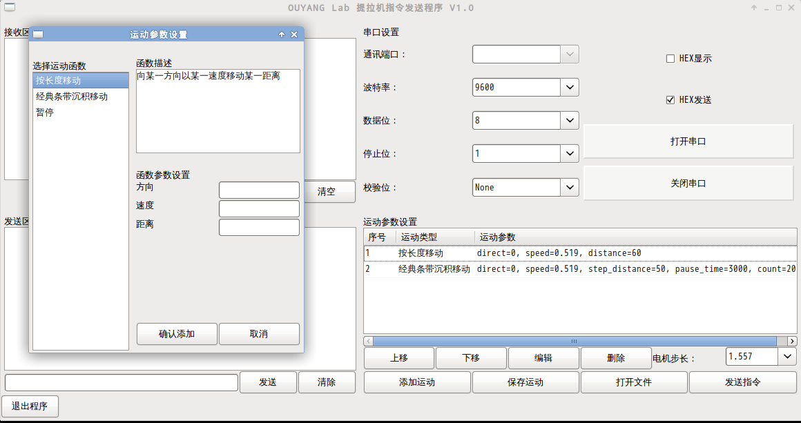

# Description
A graphical interface serial communication program with combination of command function. [一个带有组合命令功能的的图形界面串口通讯程序。]

# Develop environment
* Python 2.7.9
* pyserial 3.2.1
* wxPython 3.0.1.1
